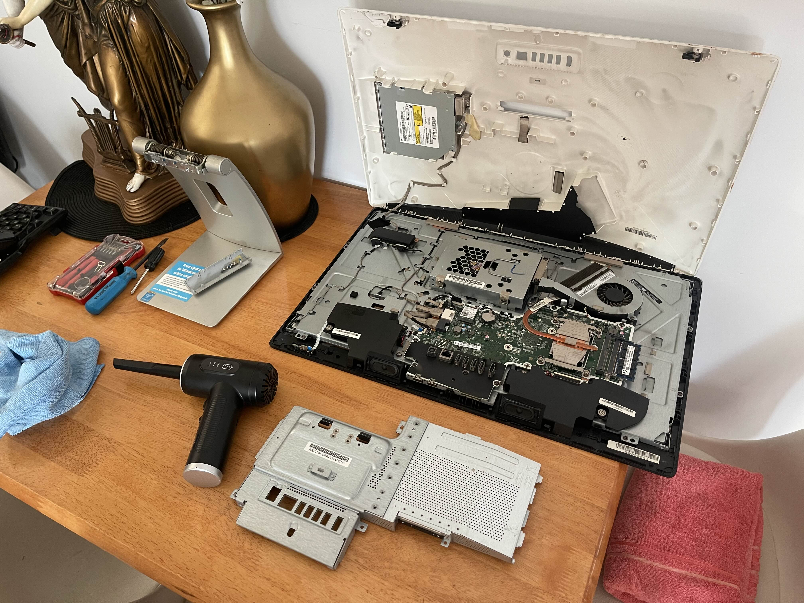
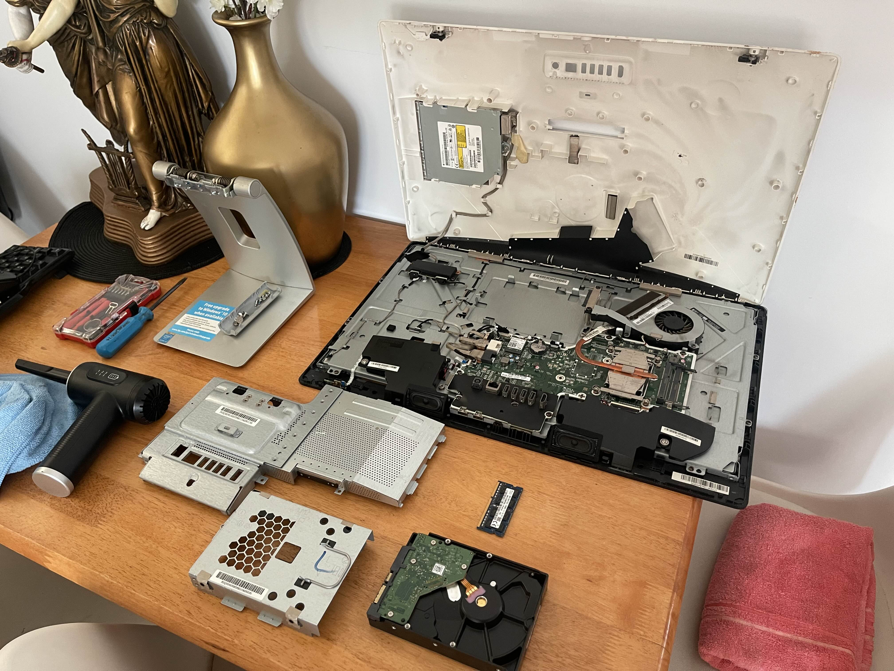
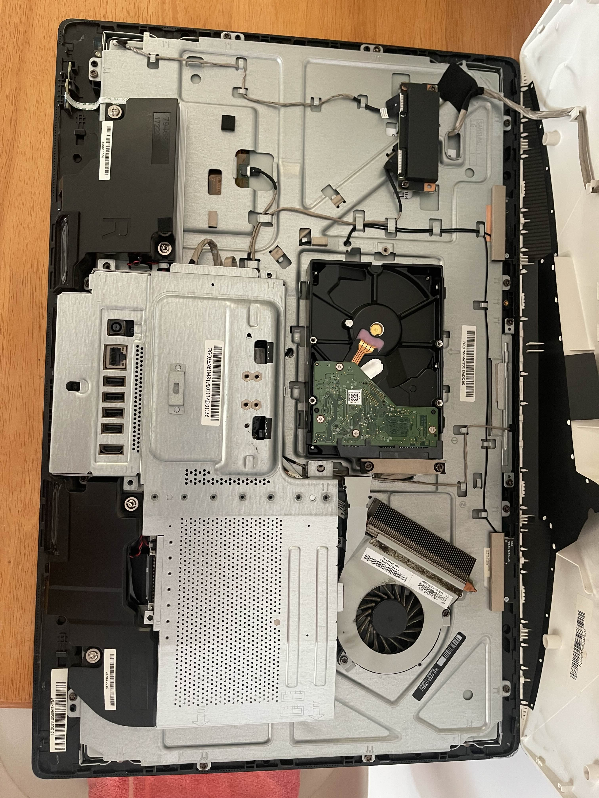
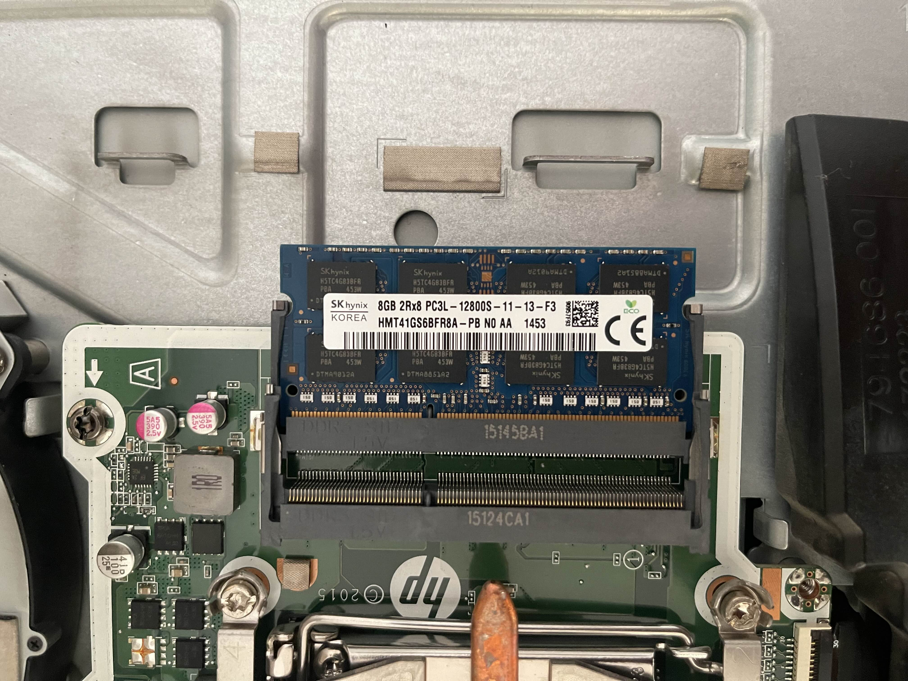
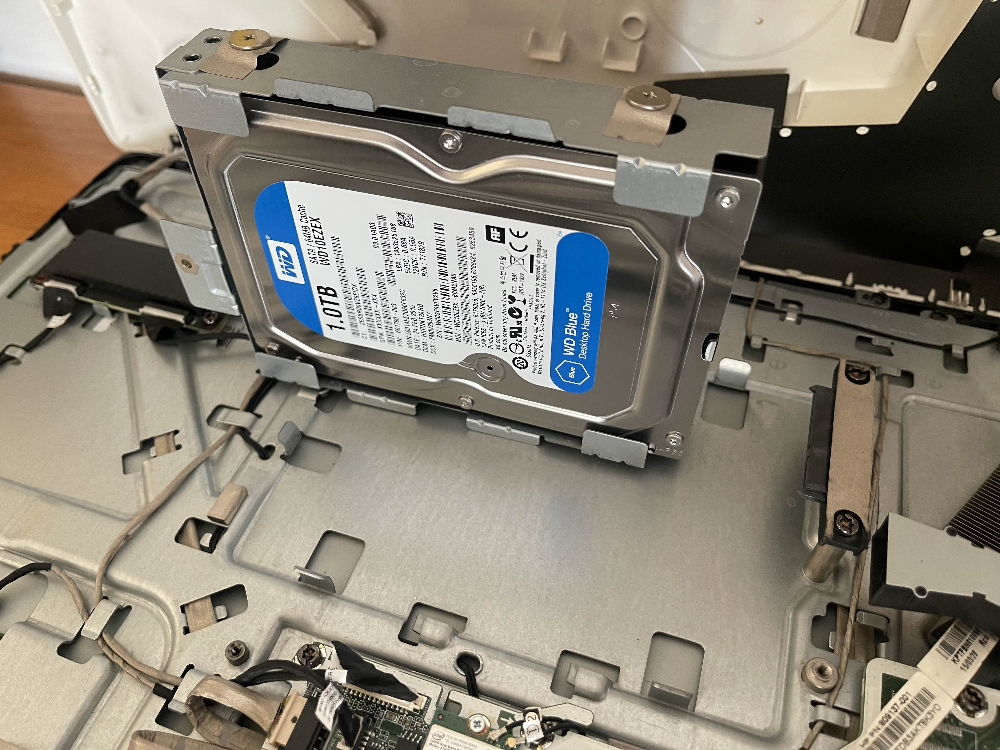
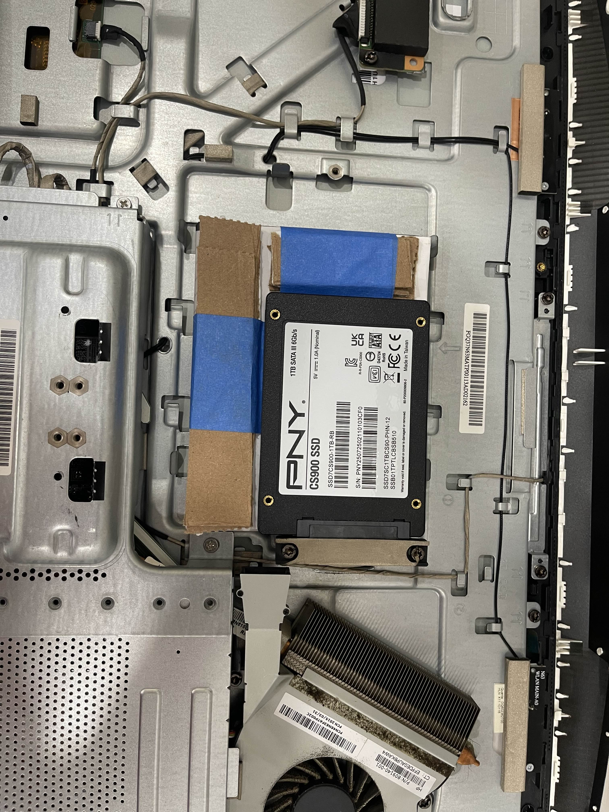
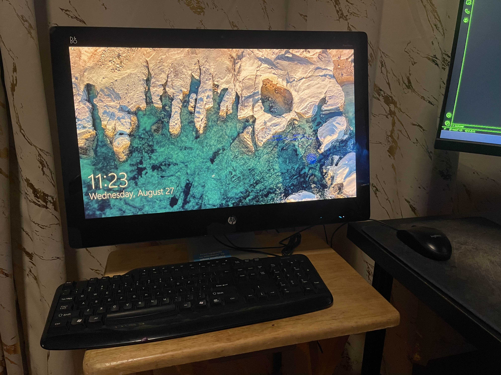

# Phase 1 – Hardware Setup

The first phase of this cyber-homelab project was focused on preparing the base hardware.  
I repurposed an **HP Pavilion 23 All-in-One (23-q067c)**, upgrading and documenting each component to ensure it could reliably support later phases (Proxmox, Pi-hole, pentest lab VMs, etc).

---

## 📋 Original Hardware Specs

Extracted via `hardware-spec-script.txt`:

- **CPU:** Intel® Core™ i5-4590T CPU @ 2.00GHz (4 cores / 4 threads)
- **RAM:** 8 GB DDR3
- **Storage:** 1 TB HDD (SATA)
- **Network:** Realtek Gigabit Ethernet (onboard)
- **GPU:** Integrated Intel HD Graphics 4600

_(See [hardware-specs.txt](./hardware-specs.txt) and [hardware.yaml](./hardware.yaml) for detailed output.)_

---

## 🛠️ Disassembly & Inspection

Opening up the Pavilion and inspecting each component:

| Step              | Image                                                                  |
| ----------------- | ---------------------------------------------------------------------- |
| Cover removed     |  |
| Fully open        |          |
| Top-down layout   |            |
| RAM slot close-up |            |
| SATA storage bay  |          |

---

## 🔧 Upgrades

- **RAM:** Increased from 8 GB → 16 GB DDR3  
  

- **Storage:** Replaced aging 1 TB HDD with a **1 TB SSD** for speed and reliability  
  

---

## ✅ Final Build

After upgrades, the Pavilion was resealed and powered up successfully:

| State                  | Image                                                                               |
| ---------------------- | ----------------------------------------------------------------------------------- |
| Internals post-upgrade |      |
| Sealed and ready       |  |
| Boot screen            |                     |

**Final Specs:**

- CPU: Intel i5-4590T
- RAM: 16 GB DDR3
- Storage: 1 TB SSD
- Network: Gigabit Ethernet

This upgraded system now serves as the **homelab host machine** and will be running Proxmox in Phase 2.

---
