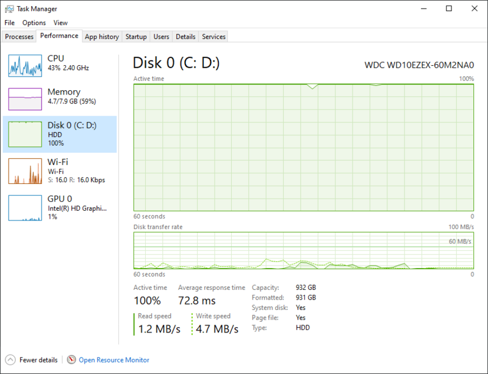
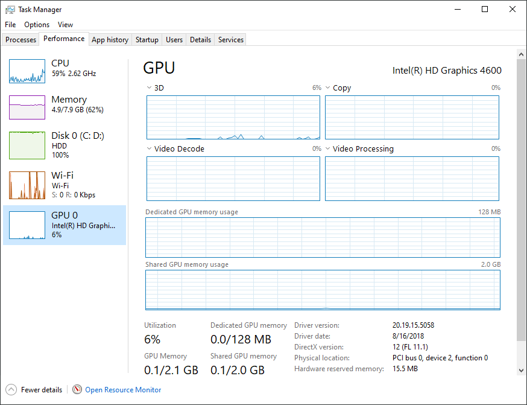

# Phase 1: Hardware Setup & Upgrades

This phase documents the foundation of the cyber-homelab: the hardware. I repurposed an **HP Pavilion 23-q067c All-in-One** system by upgrading its storage and RAM, preparing it for virtualization and lab deployments.

---

## 🖥️ Original Hardware Specs

Before upgrades, the machine had:

- **CPU**: Intel Core i5-4590T @ 2.0GHz (4 cores / 4 threads)
- **RAM**: 8 GB DDR3L
- **Storage**: 1 TB HDD (5400 RPM)
- **GPU**: Integrated Intel HD Graphics 4600

Task Manager snapshots (pre-upgrade):

- 
- 
- 
- 
- 

---

## 🔧 Teardown & Inspection

The Pavilion was disassembled to access its internals. Key steps:

- Removing the back cover
- Laying out components
- Inspecting RAM and storage slots

Pictures from the teardown:

- 
- 
- 
- 
- 

Close-up component views:

- 
- 
- 
- 

---

## 🔄 Upgrades Performed

### Memory

- Added another **8 GB DDR3L stick**, bringing total to **16 GB**.

  

### Storage

- Replaced the slow HDD with a **Samsung 870 EVO 500GB SSD** for faster performance.

---

## ✅ Reassembly & Boot

The Pavilion was carefully reassembled after upgrades.

- 
- 
- 

---

## 📂 Supporting Files

This phase includes:

- [`hardware.yaml`](./hardware.yaml): Structured hardware inventory
- [`hardware-spec-script.txt`](./hardware-spec-script.txt): Script used for pulling specs
- [`hardware-spec-script-results.txt`](./hardware-spec-script-results.txt): Captured results after running script

---

## 🚀 Outcome

With upgraded RAM and SSD storage, the Pavilion is now capable of handling **Proxmox VE** and multiple lightweight virtual machines. This sets the stage for the next phase: **Proxmox installation**.
