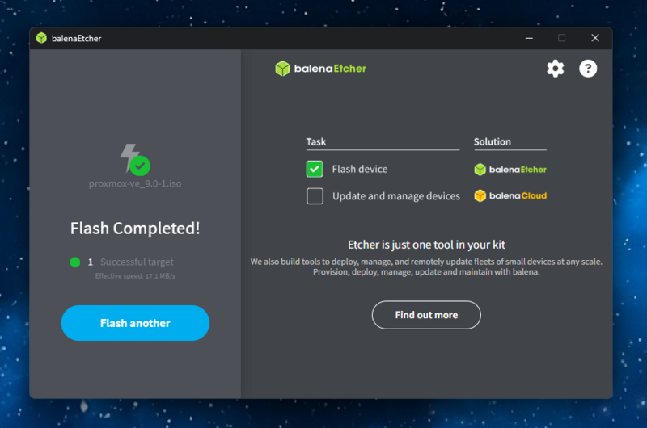
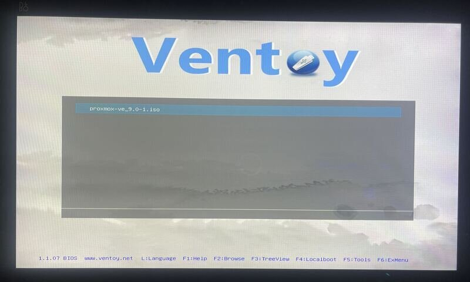
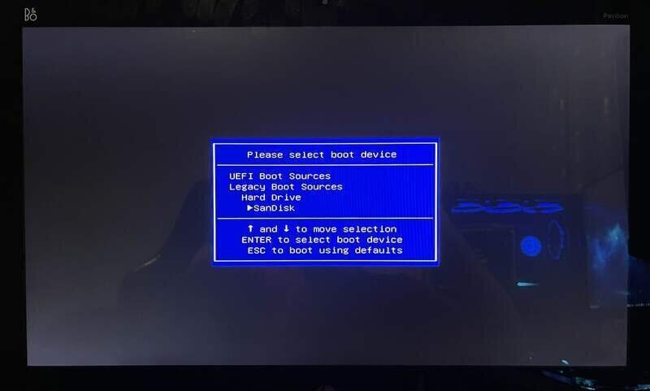
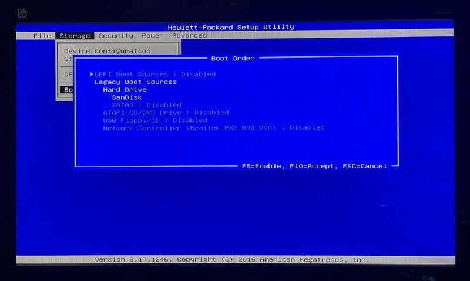
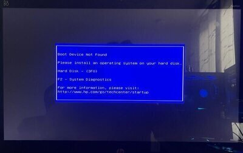
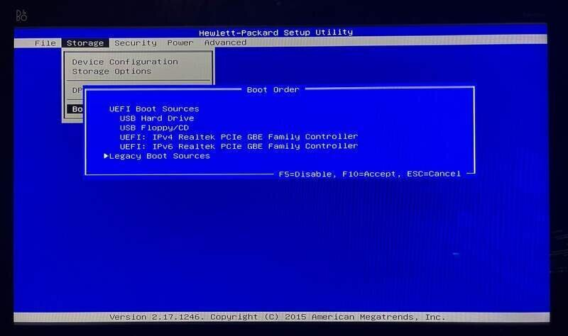
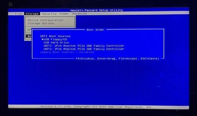
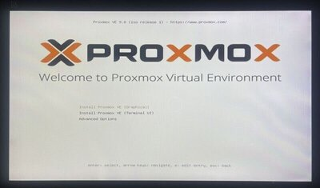
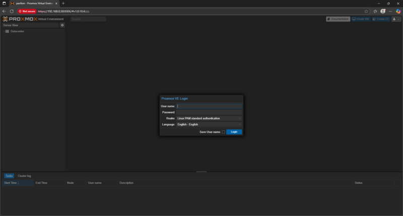
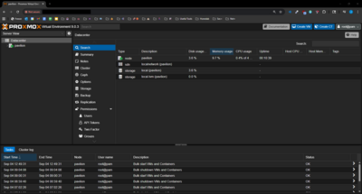

# Phase 2: Proxmox Installation

With the hardware upgraded and stable, the next step was to install a **bare-metal hypervisor**. For this homelab, I chose **Proxmox VE (Virtual Environment)** to serve as the foundation for virtualization, containerization, and resource management.

---

## 💾 Preparing Installation Media

- Downloaded the latest **Proxmox VE ISO** from the official site.
- Flashed it onto a USB thumb drive using **balenaEtcher**.

Due to issues detailed later, I switched to and tested **Ventoy** to create a bootable multi-ISO USB.

---

## ⚙️ BIOS/UEFI Configuration

To boot successfully into the installer:

1. Entered BIOS setup.
2. Disabled unnecessary boot sources.
3. Ensured only the USB was enabled.

  

At first, the drive wasn’t detected:

The fix: enabling **Legacy Boot** in BIOS.

  

---

## 🛠️ Installing Proxmox VE

Once the system recognized the USB, I booted into the **Proxmox installer**.

Steps included:

- Selecting the target SSD
- Configuring root password and email
- Setting network hostname and management IP
- Completing installation

---

## 🌐 Accessing the Web Interface

After reboot, Proxmox VE was accessible via browser at:  
`https://<proxmox-ip>:8006`

- 
- 

---

## 🚀 Outcome

At the end of Phase 2, the Pavilion is running **Proxmox VE** with access to the web management interface. This provides the core virtualization platform to deploy containers and VMs for future phases of the homelab.
