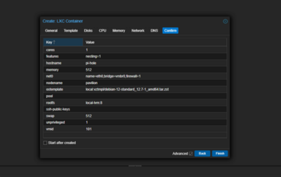
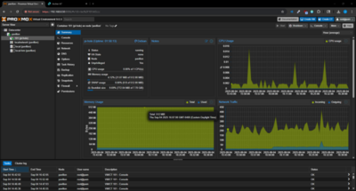
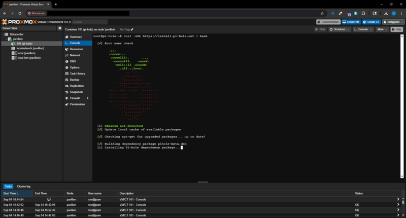
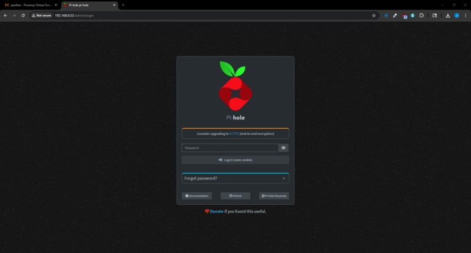
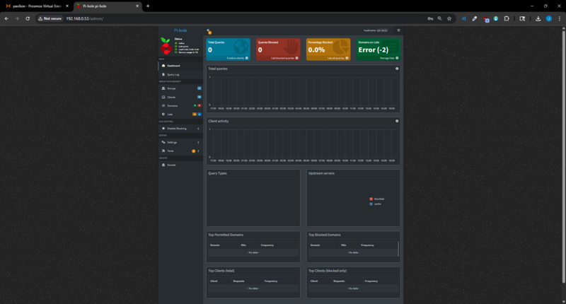
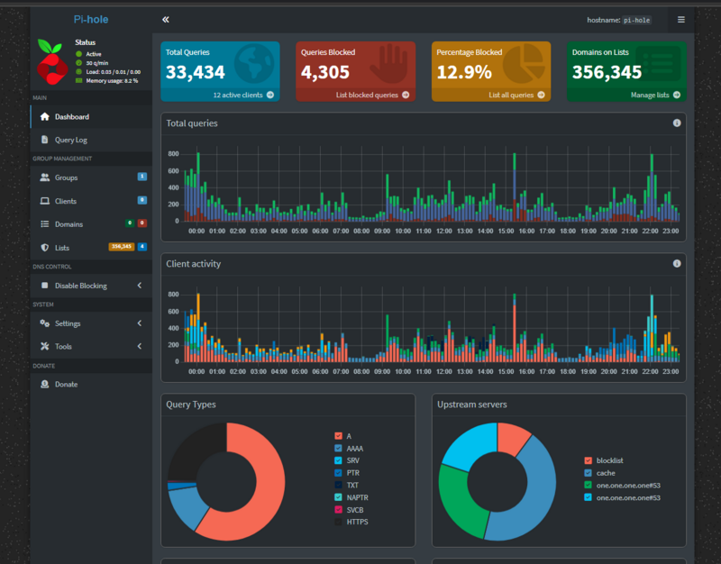

# Phase 3: Pi-hole Deployment

With Proxmox running as the hypervisor, the next step was to deploy a lightweight containerized service to improve network visibility and security. For this phase, I installed **Pi-hole** inside an **LXC container**.

---

## 🎯 Objective

- Deploy **Pi-hole** as a DNS sinkhole.
- Centralize ad-blocking and network monitoring.
- Gain experience configuring containers and networking inside Proxmox.

---

## ⚙️ Container Setup

Using the Proxmox Web UI:

1. Created an **LXC container** for Pi-hole.
2. Configured:
   - Base image: Ubuntu Server (LXC template)
   - CPU/RAM limits: modest allocation for lightweight performance
   - Networking: bridged mode for LAN visibility

  

---

## 💻 Installing Pi-hole

Logged into the container and ran the automated installation script:

Once complete, Pi-hole’s web interface was accessible at:  
`http://<pi-hole-ip>/admin`

---

## 📊 Dashboard & Testing

Initially, the router wasn’t pointing to Pi-hole as the primary DNS, so no traffic flowed through it:

After addressing this through IP reservation and other router configs, Pi-hole immediately began logging DNS queries.

- Live dashboard confirmed activity.
- Verified that blocking lists were applied.

---

## 🚀 Outcome

At the end of Phase 3:

- Pi-hole was deployed successfully in an LXC container.
- The dashboard provided DNS visibility and query logs.
- Network-level ad-blocking was functional once DNS settings were updated on the router.

This phase demonstrated container management in Proxmox and laid the foundation for central DNS-based security in the homelab.
