# Phase 4: Pentest Lab

With Pi-hole running smoothly, the next phase was to expand the homelab into a **penetration testing environment**.  
This involved creating a vulnerable target machine and a dedicated attacker VM to simulate real-world offensive security scenarios.

---

## 🎯 Objective

- Deploy a deliberately vulnerable web application (**DVWA**) for testing.
- Create an attacker environment using **Kali Linux**.
- Practice reconnaissance and exploitation workflows in a safe lab.

---

## 🖥️ Virtual Machines

### Attacker: Kali Linux

- Created a Kali Linux VM in Proxmox.
- Configured for scanning, enumeration, and exploitation.

<picture>
  

    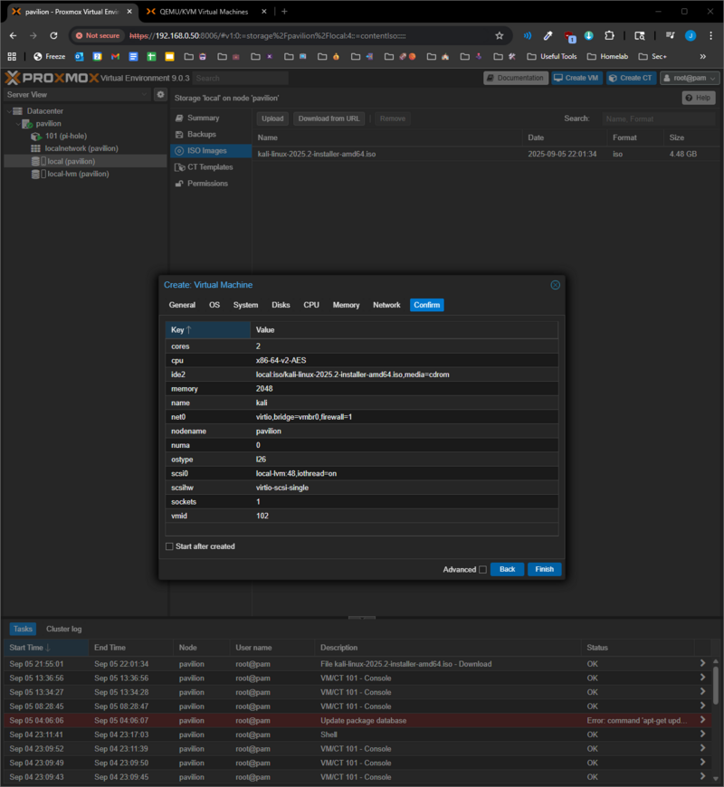
  

</picture>
<picture>
  

    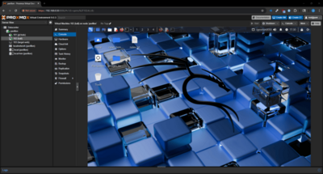
  

</picture>

---

### Target: Ubuntu + DVWA

- Installed Ubuntu Server as a Proxmox VM.
- Configured networking for LAN accessibility.
- Deployed **Damn Vulnerable Web Application (DVWA)**.

<picture>
  

    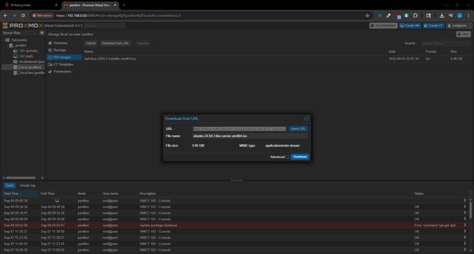
  

</picture>
<picture>
  

    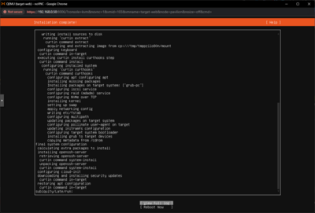
  

</picture>
<picture>
  

    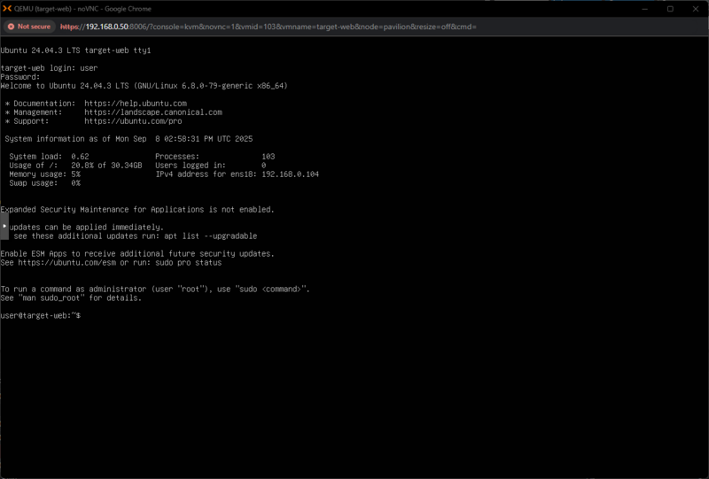
  

</picture>
<picture>
  

    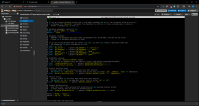
  

</picture>
<picture>
  

    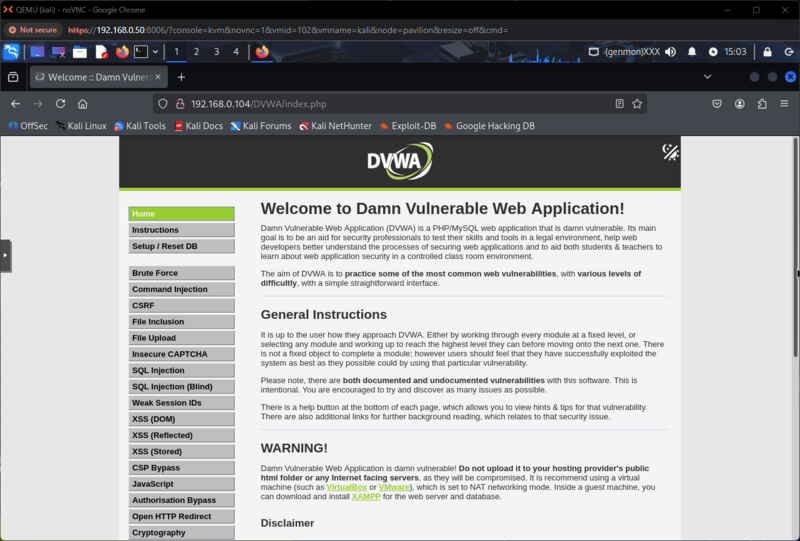
  

</picture>

---

## 🌐 Network Reconnaissance

### Connectivity Checks

Confirmed LAN reachability to Pi-hole.

<picture>
  

    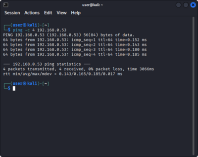
  

</picture>

### Nmap Scans

Ran a series of **Nmap scans** from the Kali VM to identify hosts and services.

<picture>
  

    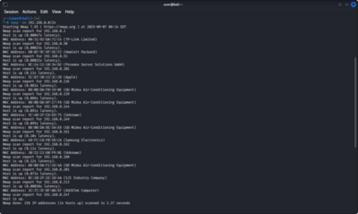
  

</picture>
<picture>
  

    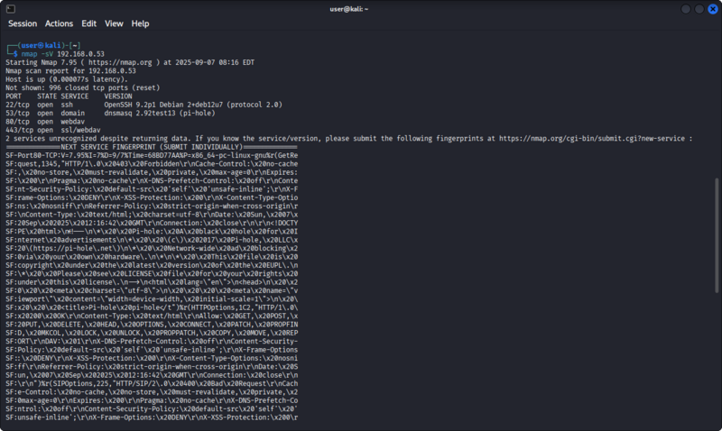
  

</picture>
<picture>
  

    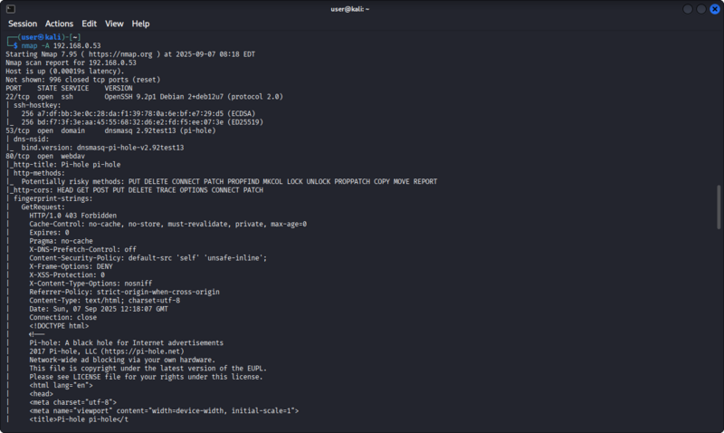
  

</picture>

---

## 📊 Collected Logs

- [`lan-discovery.txt`](lan-discovery.txt) → Results from host discovery scan.
- [`pihole-services.txt`](pihole-services.txt) → Open services enumeration.
- [`pihole-aggressive.txt`](pihole-aggressive.txt) → Aggressive scan with versions.
- [`pihole-nikto.txt`](pihole-nikto.txt) → Web vulnerability scan results.

---

## 🚀 Outcome

By the end of Phase 4:

- Built a complete **attacker-target pentest lab** inside Proxmox.
- Successfully deployed **DVWA** as a target and **Kali Linux** as the attacker.
- Performed **scanning, enumeration, and vulnerability analysis** using standard tools.

This phase turned the homelab into a dedicated environment for **offensive security training** and hands-on cybersecurity practice.
