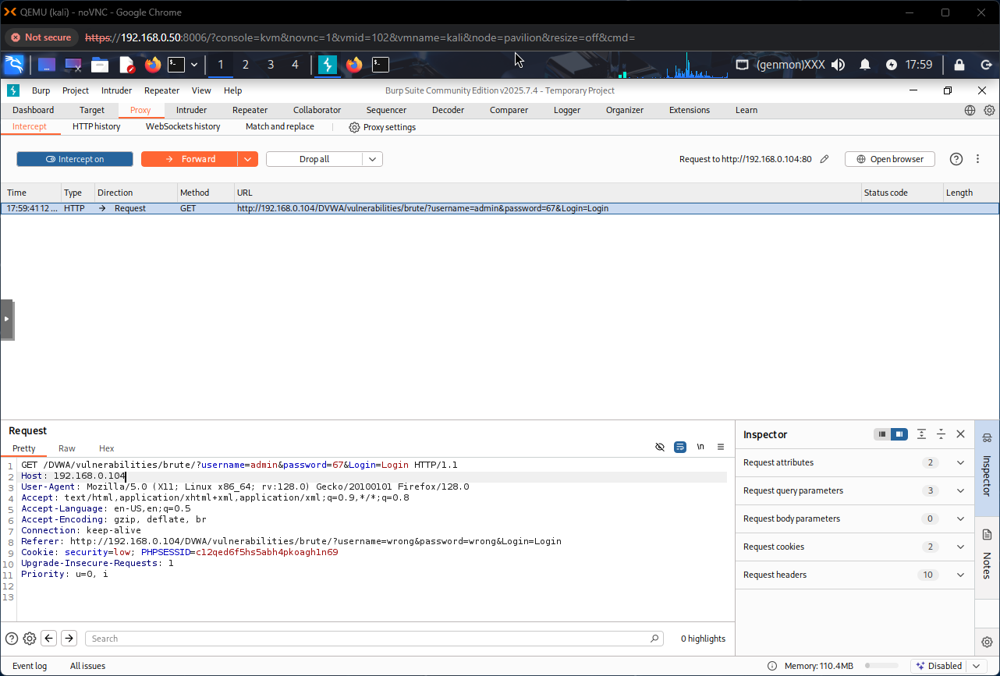
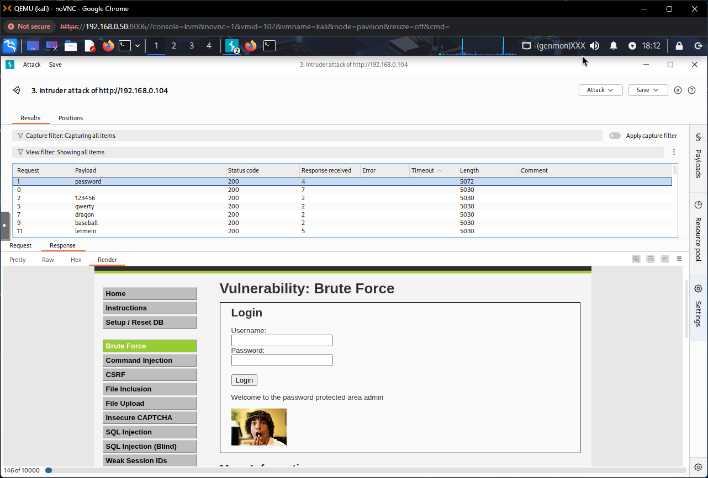
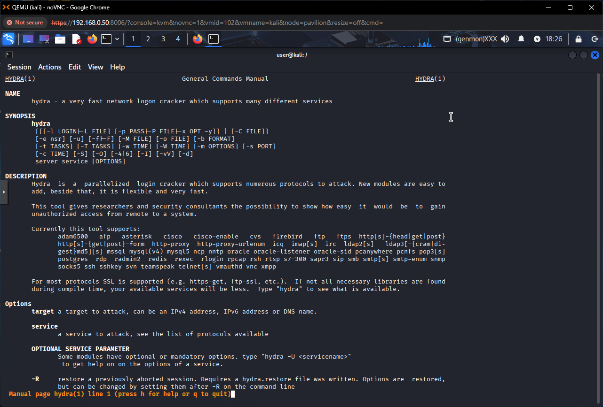
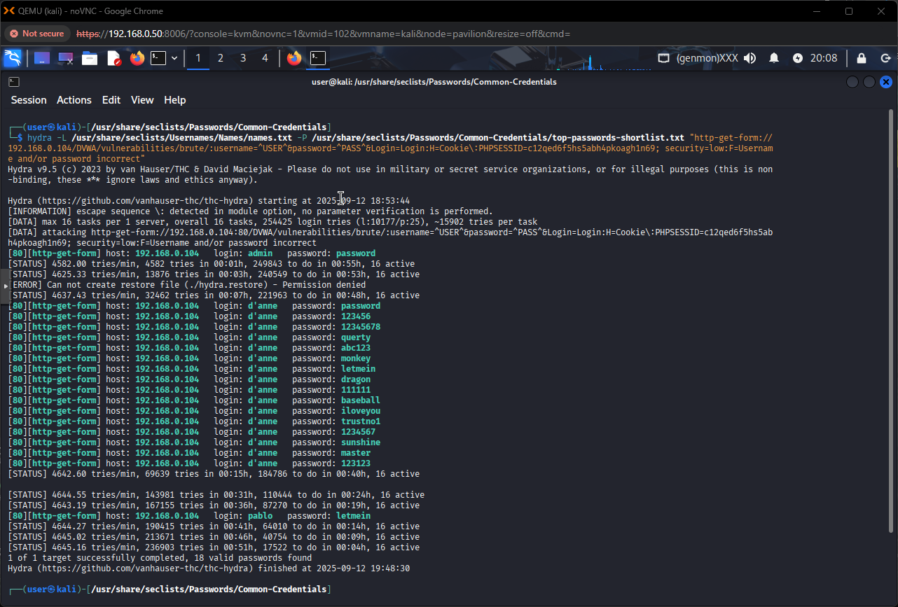
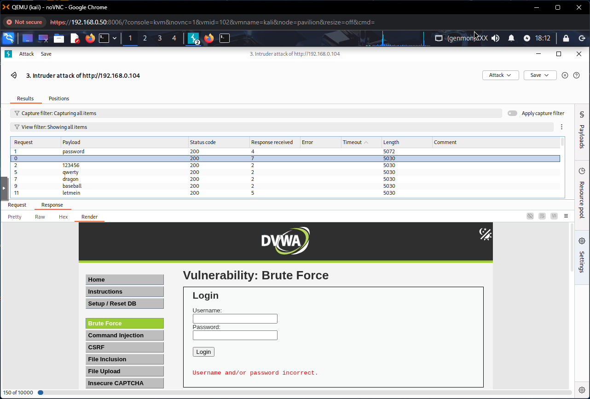

# Phase 5: Red Team — Web Application Penetration Testing (WIP)

This phase focuses on active web application testing against the Damn Vulnerable Web Application (DVWA) deployed in Phase 4. The goal is to work through DVWA's modules, document attack steps and findings, and capture lessons learned for both offensive techniques and defensive mitigations.

> **Status:** In progress — so far completed: **Brute Force (Low & Medium)**. This README will be expanded as each DVWA module is completed and documented.

---

## 🎯 Objective

- Systematically test and exploit DVWA modules to learn common web vulnerabilities (authentication, injection, file upload, XSS, CSRF, command injection, etc.).
- Record step-by-step procedures, tooling, payloads, and mitigation notes.
- Produce reproducible notes and artifacts for each module so the exercises can be repeated or graded.

---

## 🧭 Scope & Approach

- Work inside the isolated lab (Kali → DVWA on Ubuntu VM) to avoid collateral impact.
- Use a mix of manual inspection and automated tooling (Burp Suite, Hydra, Nikto, custom wordlists).
- Capture screenshots, command output, and crafted payloads into the repo under `phase5-red-team/` for traceability.

---

## ✔️ Completed (so far)

### Brute Force (Low)

- Tooling: **Burp Suite** intercept + Intruder (simple wordlist).
- Action: Intercepted login POST, used Burp Intruder with a small wordlist.
- Result: Successfully cracked the `admin` account password.

<picture>
  

    
  

</picture>

<picture>
  

    
  

</picture>

### Brute Force (Medium)

- Tooling: **Hydra** with curated wordlists and adjusted timing (target had a 2s delay).
- Actions:
  - Extracted the POST URL, cookie/token requirements, and form parameters.
  - Created focused username and password lists (`combined-usernames-no-apostrophe.txt`, `combined-passwords.txt`).
  - Ran `hydra` against the form (supply captured cookie if required) and iterated on timing/rate to account for the 2s delay.
- Findings:
  - Successfully cracked `admin` and `pablo` accounts despite the artificial delay, showing that simple time-delay throttling is insufficient without account lockout or adaptive rate-limiting.

<picture>
  

    
  

</picture>

<picture>
  

    
  

</picture>

---

## 🔎 Vulnerability Discovery (observations)

- Input containing an apostrophe (`'`) in the username field produced an **SQL error message**, indicating an unhandled SQL exception and a likely SQL Injection surface in the authentication routine. This is an important discovery to pursue in an upcoming module (SQLi).
- The login form does not implement effective account lockout or CAPTCHA protections under medium settings — brute-force is feasible with modest resources.

<picture>
  

    
  

</picture>

---

## 🧾 Artifacts & Logs

Files stored in this phase folder (referenced below):

- `phase5-red-team/brute-force/combined-usernames-no-apostrophe.txt` — curated username list used for second hydra run.
- `phase5-red-team/brute-force/combined-passwords.txt` — combined/filtered password list crafted from seclists.
- `phase5-red-team/brute-force/brute-force-results.json` — structured capture of hydra results (where applicable).

Screenshots and captures (see `images/phase5-red-team/`):

- `BRUTE-FORCE-intercept-login.png`
- `BRUTE-FORCE-html-render-of-successful-login.png`
- `BRUTE-FORCE-hydra-commands.png`
- `BRUTE-FORCE-hydra-successful-attack.png`
- `BRUTE-FORCE-created-new-pass-list-for-second-attack.png`
- `BRUTE-FORCE-created-new-user-list-for-second-attack.png`
- `BRUTE-FORCE-sort-attack-responses-by-size.png`
- `traffic-intercepted.png`, `foxyproxy-burpsuite-ready-to-intercept.png`, etc.

---

## 🛡️ Defensive Notes (Mitigations & Hardening)

Based on brute-force testing so far, recommended defenses to implement and verify:

- Enforce **account lockout** or exponential backoff after multiple failed attempts.
- Implement **multi-factor authentication** for sensitive accounts.
- Add **CAPTCHA** or progressive challenges for repeated failed logins.
- Avoid leaking SQL errors to the user; use generic error messages and parameterized queries to prevent SQLi.
- Monitor and alert on unusual authentication patterns (e.g., many failed attempts from same IP or dispersed targets).

---

## 🔜 Next Steps (planned modules & checklist)

Planned DVWA modules to work through (each will get a detailed sub-page with steps, payloads, screenshots, and mitigations):

- [ ] SQL Injection (confirm vulnerability, extract schema/data safely)
- [ ] File Upload (test for unrestricted upload & remote code execution)
- [ ] Cross-Site Scripting (stored & reflected)
- [ ] CSRF (identify and exploit missing tokens)
- [ ] Command Injection / OS Commanding
- [ ] Insecure Direct Object References (IDOR)
- [ ] Security misconfigurations (headers, CORS, etc.)
- [ ] Session management & token analysis

For each module I will:

1. Describe the attack surface & prerequisites.
2. Show step-by-step exploitation and captured evidence.
3. Document remediation and lab verification steps after fixes.

---

## 🚀 Outcome (so far)

- Demonstrated practical password-guessing workflows using **Burp Suite** and **Hydra**.
- Captured a reproducible path to compromise low/medium authentication protections.
- Discovered an SQL error that indicates a likely SQLi vector — prioritized for the next module.

---

## 📁 Where to find artifacts

- Phase notes and artifacts: `phase5-red-team/`
- Brute-force lists & results: `phase5-red-team/brute-force/`
- All related screenshots: `images/phase5-red-team/`

---

If you want, I can now:

- Expand this README into separate module subpages (e.g., `phase5-red-team/sql-injection.md`) and auto-fill a Brute Force deep-dive (commands, full hydra syntax, Burp intruder config) using your captured screenshots and the files in `brute-force/`. Which would you prefer I do next?
